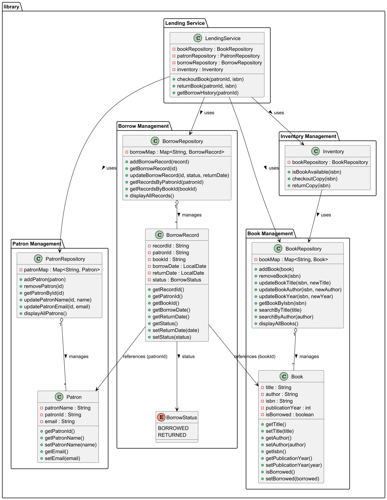

# Library Management System

## Description
This project is a Library Management System built in Java to help librarians manage books, patrons, and lending processes efficiently.
It demonstrates object-oriented programming, SOLID principles, and proper use of Java collections and logging.


### Features
- Add, update, and remove books and patrons.
- Check book availability and manage inventory.
- Checkout and return books.
- Track borrow history for each patron.

---

## Project Structure
org.library
├── bookmanagement
│ ├── Book.java
│ └── BookRepository.java
├── patronmanagement
│ ├── Patron.java
│ └── PatronRepository.java
├── borrow
│ ├── BorrowRecord.java
│ ├── BorrowRepository.java
│ └── BorrowStatus.java
├── inventorymanagement
│ └── Inventory.java
├── lendingService
│ └── LendingService.java
└── Main.java

-------------

## UML Class Diagram
The diagram below shows the relationships between classes, repositories, and services:


- **Aggregation:** Repositories manage entities (`BookRepository → Book`, `PatronRepository → Patron`, `BorrowRepository → BorrowRecord`)
- **Association:** `BorrowRecord` references `Book` and `Patron`
- **Dependency:** `LendingService` depends on repositories and inventory, `Inventory` depends on `BookRepository`

------------

## How to Run
1. Clone the repository:
    ```
    git clone https://github.com/pranalipolekar/LibraryManagementSystem.git
    ```
2. Open the project in IntelliJ or any Java IDE.
3. Run `Main.java` to test the system.

------------
## Future Enhancements
- Multi-branch support
- Reservation system with notifications
- Book recommendation system
- Use design patterns like Observer and Factory

----------- 
## Contributing
Contributions are welcome! Please fork the repository and create a pull request with your changes.
"Assignment submission by <Pranali Polekar>" 
